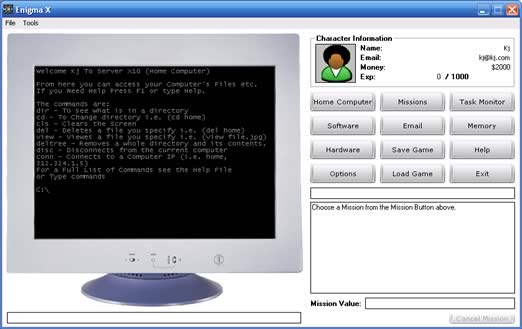



## Enigma X

### Description

This is a little Hacking Game (THAT IS STILL IN DEVELOPMENT). I mainly put it up here to see if there would be any interest in the final product.

NOTE: This code uses the isButton 3.0 Control. Author: Fred.cpp

URL:http://www.Planet-Source-Code.com/vb/scripts/ShowCode.asp?txtCodeId=56053&lngWId=1

Program Update v0.0002
 
### More Info
 

             |
---                |---
**Submitted On**   |2004-12-12 22:50:12
**By**             |[Kenneth Redpath](https://github.com/Planet-Source-Code/PSCIndex/blob/master/ByAuthor/kenneth-redpath.md)
**Level**          |Beginner
**User Rating**    |5.0 (10 globes from 2 users)
**Compatibility**  |VB 5\.0, VB 6\.0
**Category**       |[Games](https://github.com/Planet-Source-Code/PSCIndex/blob/master/ByCategory/games__1-38.md)
**World**          |[Visual Basic](https://github.com/Planet-Source-Code/PSCIndex/blob/master/ByWorld/visual-basic.md)
**Archive File**   |[Enigma\_X18288312132004\.zip](https://github.com/Planet-Source-Code/kenneth-redpath-enigma-x__1-57614/archive/master.zip)

